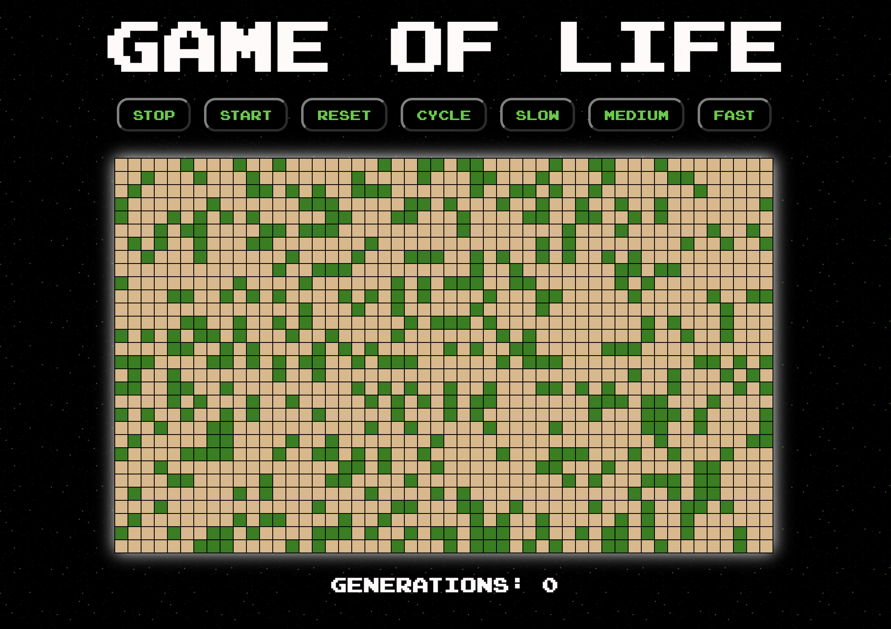

# Conway's Game of Life

**[Link to live site](https://lifegameof.netlify.app/ "Conway's Game of Life")** - courtesy of Netlify

## Preview:

## Built with:

- React
- Create React App
- ESLint
- Prettier

## Local development

1. `npm install` to get dependencies
2. `npm start` to run a development server, this will open the game in your browser
3. Open `./src/index.js` in your code editor

## Contact

`Nick Wittenberg - junior web developer`

- Linkdin: https://www.linkedin.com/in/nick-wittenberg/

- gitHub: https://github.com/Nick-Wittenberg
